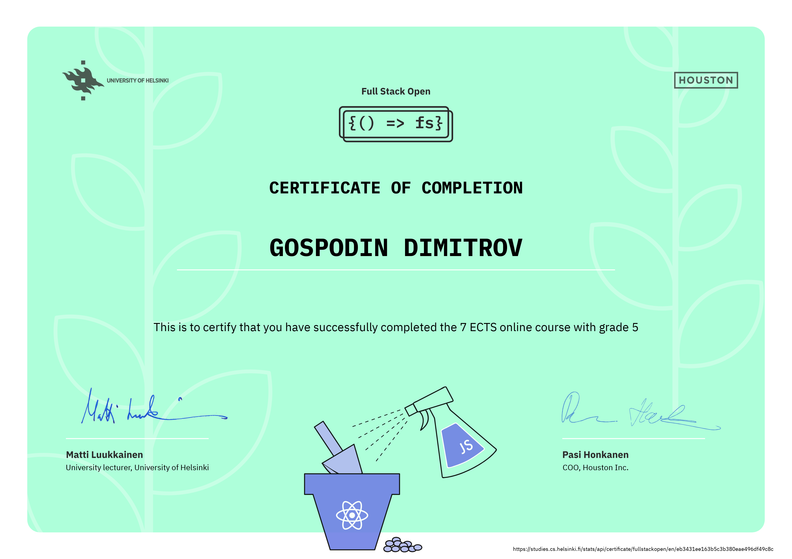
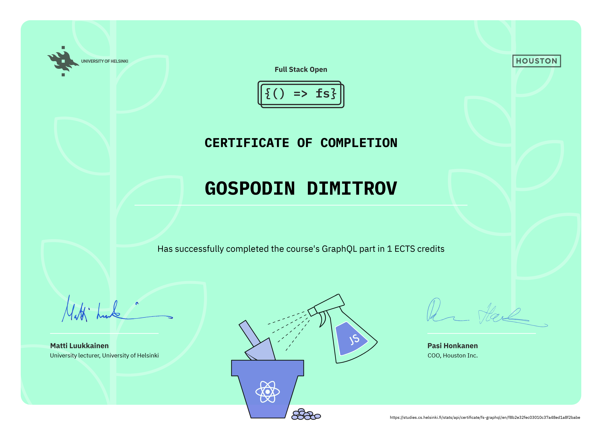

# University of Helsinki - Full Stack Open 2024

This repository contains my assignment submissions for Helsinki University Full Stack Open 2024
([https://fullstackopen.com/en/](https://fullstackopen.com/en/)).

The course is on modern JavaScript-based Web Development. The main focus is on building single page
applications with ReactJS that use REST APIs built with Node.js.

The course also contains additional sections for the following:

- GraphQL, a modern alternative to REST APIs.
- TypeScript, an open-source typed superset of JavaScript that compiles to plain JavaScript.
- React Native, an open-source UI software framework to create native mobile applications using
  JavaScript. (not completed yet)
- CI/CD, Continuous integration (CI) and continuous delivery (CD) (not completed yet)
- Docker Containers, an open platform for developing, shipping, and running applications by
  virtualizing the operating system of the computer on which it is installed and running. (not
  completed yet)
- Relational databases. (not completed yet)

## Parts

- [x] [Part 0: Fundamentals of Web apps](./part0)
- [x] [Part 1: Introduction to React](./part1)
- [x] [Part 2: Communicating with server](./part2)
- [x] [Part 3: Programming a server with NodeJS and Express](./part3)
- [x] [Part 4: Testing Express servers, user administration](./part4)
- [x] [Part 5: Testing React apps](./part5)
- [x] [Part 6: Advanced state management](./part6)
- [x] [Part 7: React router, custom hooks, styling app with CSS and webpack](./part7)
- [x] [Part 8: GraphQL](./part8)
- [x] [Part 9: TypeScript](./part9)
- [ ] Part 10: React Native
- [ ] Part 11: CI/CD
- [ ] Part 12: Containers
- [ ] Part 13: Using Relational Databases

## Certificates

