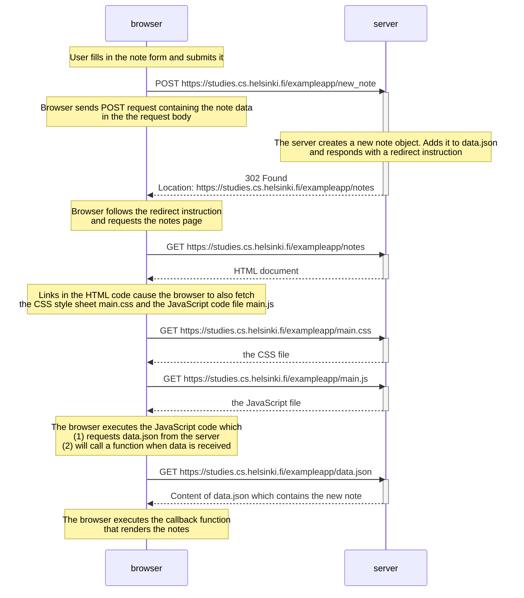

```mermaid
sequenceDiagram
    participant browser
    participant server

    Note over browser: User fills in the note form and submits it
    browser->>server: POST https://studies.cs.helsinki.fi/exampleapp/new_note
    activate server
    Note over browser: Browser sends POST request containing the note data<br>in the the request body
    Note over server: The server creates a new note object. Adds it to data.json<br>and responds with a redirect instruction
    server-->>browser: 302 Found<br>Location: https://studies.cs.helsinki.fi/exampleapp/notes
    deactivate server

    Note over browser: Browser follows the redirect instruction<br>and requests the notes page
    browser->>server: GET https://studies.cs.helsinki.fi/exampleapp/notes
    activate server
    server-->>browser: HTML document
    deactivate server

    Note over browser: Links in the HTML code cause the browser to also fetch<br>the CSS style sheet main.css and the JavaScript code file main.js
    browser->>server: GET https://studies.cs.helsinki.fi/exampleapp/main.css
    activate server
    server-->>browser: the CSS file
    deactivate server

    browser->>server: GET https://studies.cs.helsinki.fi/exampleapp/main.js
    activate server
    server-->>browser: the JavaScript file
    deactivate server

    Note over browser: The browser executes the JavaScript code which<br>(1) requests data.json from the server<br>(2) will call a function when data is received
    browser->>server: GET https://studies.cs.helsinki.fi/exampleapp/data.json
    activate server
    server-->>browser: Content of data.json which contains the new note
    deactivate server

    Note over browser: The browser executes the callback function<br>that renders the notes
```
