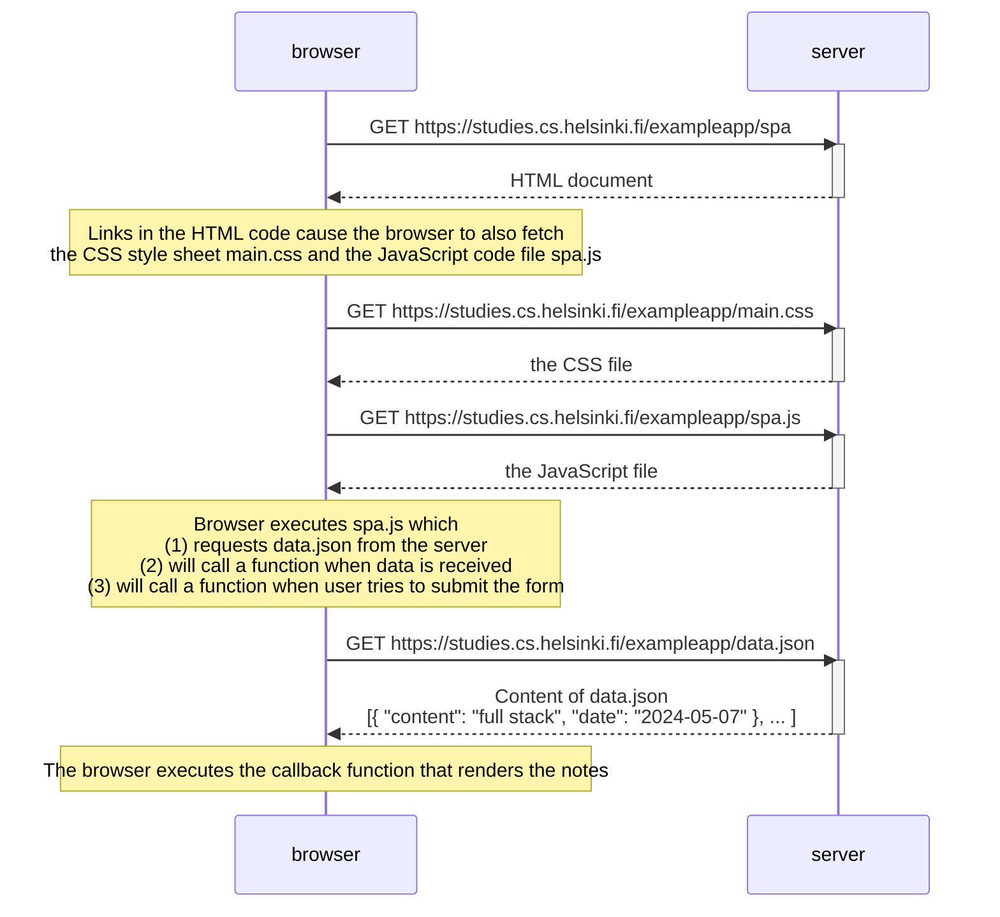

```mermaid
sequenceDiagram
   participant browser
   participant server

   browser->>server: GET https://studies.cs.helsinki.fi/exampleapp/spa
   activate server
   server-->>browser: HTML document
   deactivate server

   Note over browser: Links in the HTML code cause the browser to also fetch<br>the CSS style sheet main.css and the JavaScript code file spa.js
   browser->>server: GET https://studies.cs.helsinki.fi/exampleapp/main.css
   activate server
   server-->>browser: the CSS file
   deactivate server

   browser->>server: GET https://studies.cs.helsinki.fi/exampleapp/spa.js
   activate server
   server-->>browser: the JavaScript file
   deactivate server

   Note over browser: Browser executes spa.js which<br>(1) requests data.json from the server<br>(2) will call a function when data is received<br>(3) will call a function when user tries to submit the form
   browser->>server: GET https://studies.cs.helsinki.fi/exampleapp/data.json
   activate server
   server-->>browser: Content of data.json<br>[{ "content": "full stack", "date": "2024-05-07" }, ... ]
   deactivate server

   Note over browser: The browser executes the callback function that renders the notes
```
