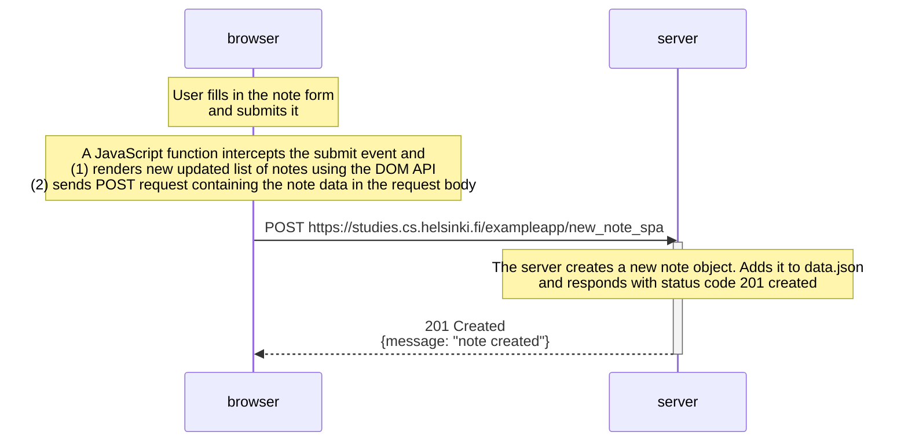

```mermaid
sequenceDiagram
    participant browser
    participant server

    Note over browser: User fills in the note form<br>and submits it
    Note over browser: A JavaScript function intercepts the submit event and<br>(1) renders new updated list of notes using the DOM API<br>(2) sends POST request containing the note data in the request body
    browser->>server: POST https://studies.cs.helsinki.fi/exampleapp/new_note_spa
    activate server
    Note over server: The server creates a new note object. Adds it to data.json<br>and responds with status code 201 created
    server-->>browser: 201 Created<br>{message: "note created"}
    deactivate server
```
